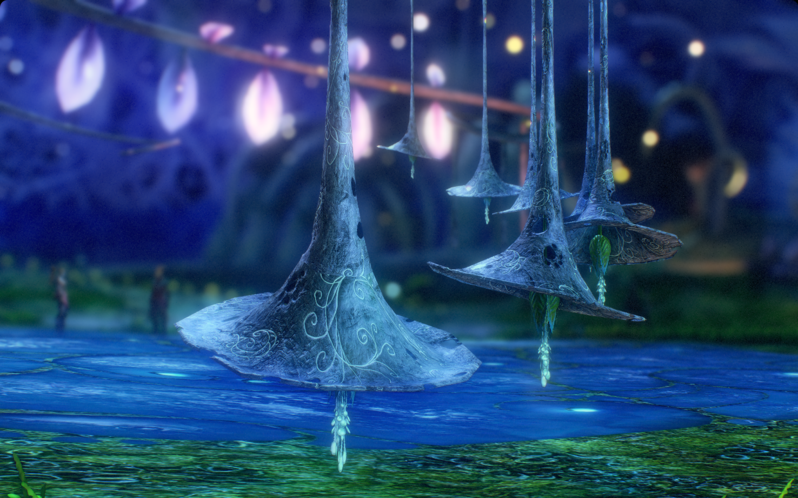
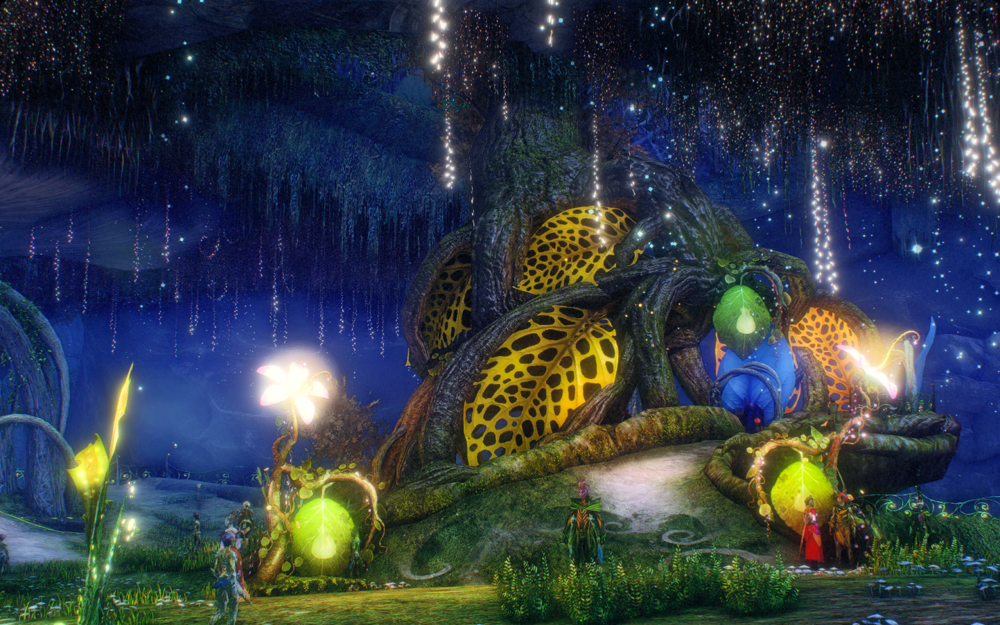
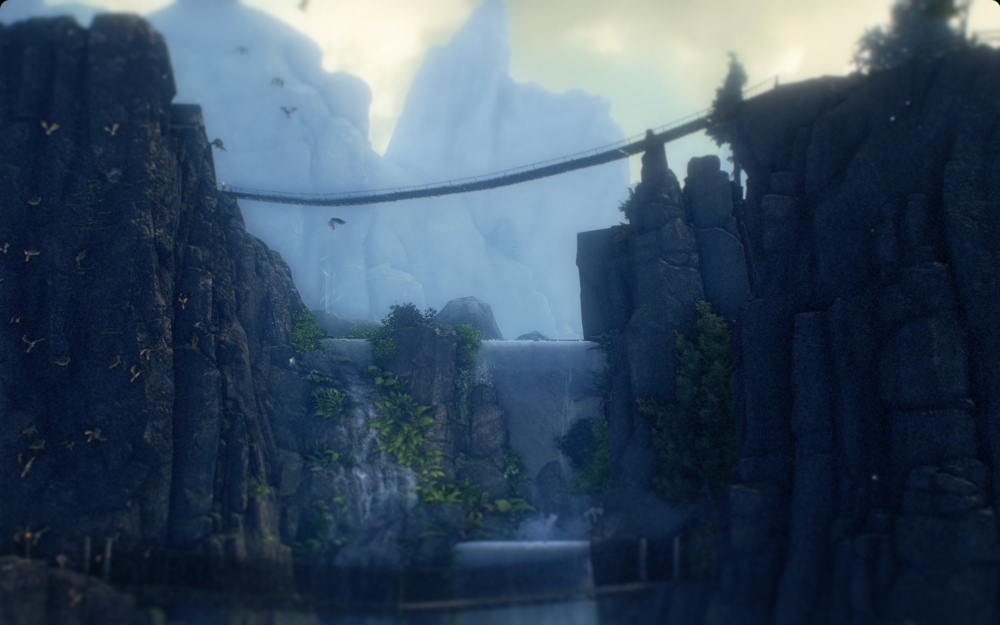
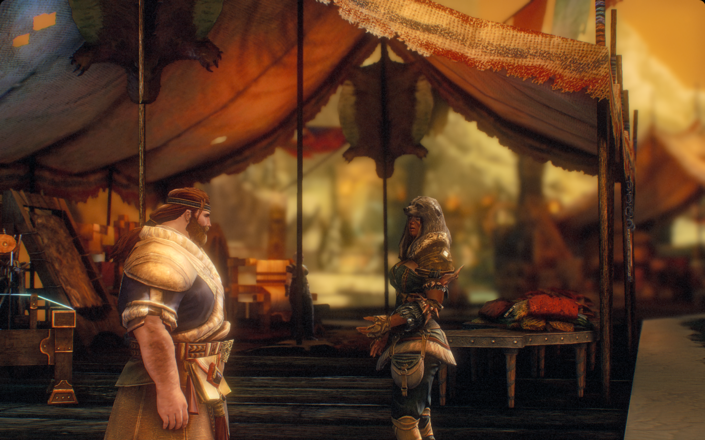
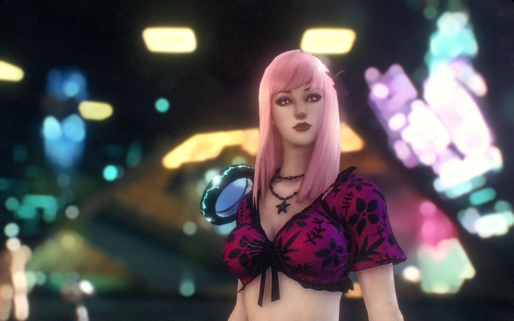
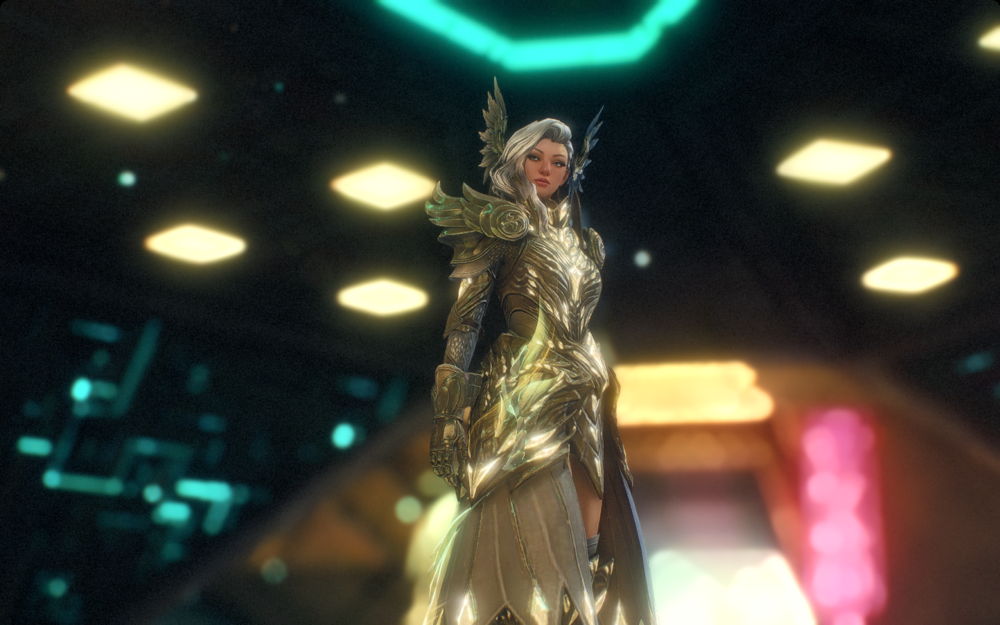
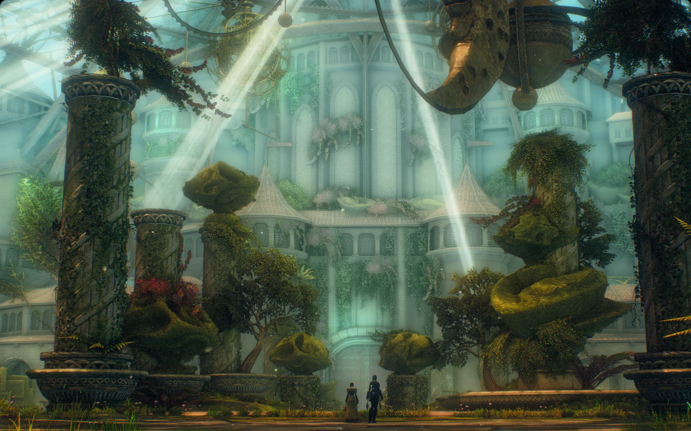
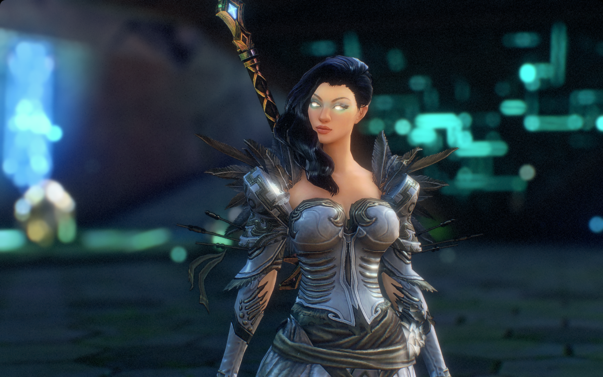
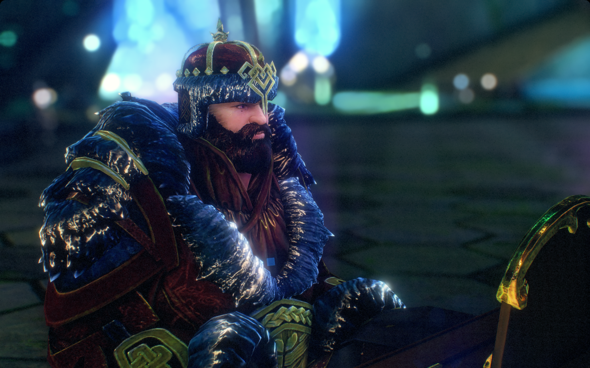
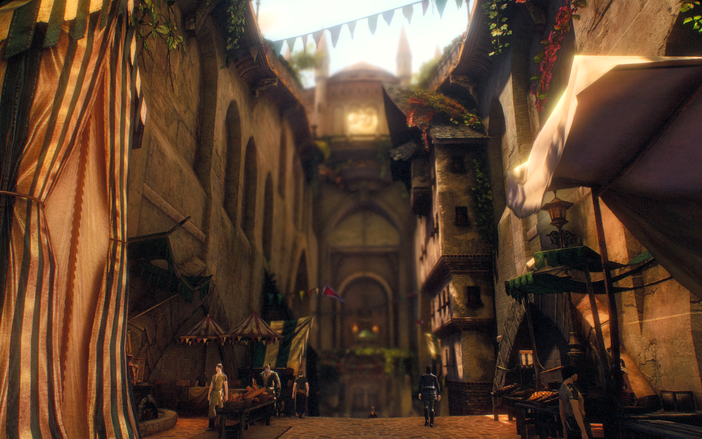

# Elora's Personal Presets – Guild Wars 2 ReShade (v6.5.1)

Welcome! This guide will walk you through installing and using my custom ReShade preset for Guild Wars 2, updated for ReShade 6.5.1. It includes a full list of required shaders, recommended in-game graphics settings, and tips for best results.

---

## Table of Contents

1. [About This Preset](#about-this-preset)
2. [Requirements](#requirements)
3. [Required Shaders (.fx files)](#required-shaders-fx-files)
4. [Installation Instructions](#installation-instructions)
5. [In-Game Graphics Settings (Recommended)](#in-game-graphics-settings-recommended)
6. [FOV & Camera Tips](#fov--camera-tips)
7. [Troubleshooting & FAQ](#troubleshooting--faq)
8. [Credits & Resources](#credits--resources)
9. [Preset Previews](#preset-previews)

---

## About This Preset

This preset is designed for high-quality screenshots and immersive exploration in Guild Wars 2. It enhances lighting, contrast, bloom, and ambient occlusion for a cinematic look. The First Person Photos and Third Person Photos presets are designed for taking screenshots using the specified perspectives, the main difference between them being the hyperfocal distance setting in the ADOF.fx filter. I'll be working on developing an additional set of presets that are less intensive and can be used for general gameplay, when those are completed I'll merge those into the main branch, create a new release, and update the changelog. Stay tuned!

---

## Requirements

- **Guild Wars 2** (latest version)
- **ReShade 6.5.1** ([Download here](https://reshade.me/#download))
- Windows 10/11

---

## Required Effect Packages/Shaders (.fx files)

Below is the exact list of .fx files required by this preset, as referenced in the preset's Techniques. Ensure these files are present in your ReShade `Shaders` folder:

- Zenteon_Framework.fx
- MartysMods_LAUNCHPAD.fx
- MartysMods_MXAO.fx
- PPFX_SSDO.fx
- NeoSSAO.fx
- NGLighting.fx
- AmbientLight.fx
- ZN_LC.fx
- CAS.fx
- HexLensFlare.fx
- MagicBloom.fx
- PD80_02_Bloom.fx
- PD80_04_Color_Temperature.fx
- Quark_Local_Contrast.fx
- Quark_Xenon_Bloom.fx
- Reinhard.fx
- Vibrance.fx
- lilium__rcas_hdr.fx
- Zenteon_Sharpen.fx
- Zenteon_XenonBloom.fx
- BloomingHDR.fx
- GloomAO.fx
- FGFXLargeScalePerceptualObscuranceIrradiance.fx
- LocalContrast.fx
- qUINT_dof.fx
- pCamera.fx
- pColors.fx
- SmartDeNoise.fx

> **Note:**
> - The list above is derived directly from the preset's Techniques line. Some techniques may reference the same .fx file with different technique names.
> - If you are missing any of these, you can download them from the official ReShade repositories or the shader authors' GitHubs. Some may be in optional or third-party packs.
> - When installing ReShade, you can select these filters during the setup process, personally, I install all available filters to give myself room to experiment

---

## Installation Instructions

1. **Download & Install ReShade 6.5.1**
   - Run the ReShade installer (I recommend the ReShade 6.5.1 with full add-on support for future proofing). ([Download here](https://reshade.me/#download))
   - Select your `Gw2-64.exe` (Guild Wars 2 executable), it may not appear on the default list of applications, and if so, navigate to the default file location and select it `C:\Program Files\Guild Wars 2` (default path).
   - Choose DirectX 10/11/12.
   - If you plan on using my preset and want to streamline the installation, on the next screen you can click the `Browse...` button, navigate to my preset, select it, and it will install all the effect packages used in my preset, otherwise you can click on the `Skip` button.
   - When prompted, select the effect packages you would like to install, if you would like to experiment I suggest clicking the `Check all` button to install all of them, otherwise you can select the files listed above in [Required Shaders (.fx files)](#required-shaders-fx-files). A simpler method however would be to select my .ini file in the previous step.
   - You can safely `Skip` the list of plugins as my presets don't require any at the moment.
   - Click `Finish`.

2. **Copy the Preset**
   - Place `Elora's Personal Presets - Standard - First Person Photos.ini` and `Elora's Personal Presets - Standard - Third Person Photos.ini` into your Guild Wars 2 game folder (`C:\Program Files\Guild Wars 2` (default path)). (not required if you selected my .ini files in the first step)

3. **Add Required Shaders**
   - Ensure all required .fx files (see above) are in your `reshade-shaders\Shaders` folder. (not required if you installed them in the first step)
   - Place any required textures in `reshade-shaders\Textures` if needed. (not required if you installed them in the first step)

4. **Rename dxgi.dll to d3d11.dll**
   - In `C:\Program Files\Guild Wars 2` (default path) rename the `dxgi.dll` to `d3d11.dll`, this change is required since the update to DX11 in order for ReShade to recognize Guild Wars 2 and initialize during launch. If you'd like to be extra safe, you can create a backup copy of this file first before renaming.

5. **Launch Guild Wars 2**
   - Press `Home` to open the ReShade menu.
   - Select the preset from the dropdown.

6. **Set a Toggle Key** (optional)
   - Navigate to the `Settings` tab.
   - Bind a key for `Effect Toggle Key`.
   - Use your keybind to turn the effect on and off whenever it suits you.

---

## In-Game Graphics Settings (Recommended)

For best results, match these settings as closely as possible:

**Display**
- Resolution: Windowed Fullscreen
- Frame Limiter: Unlimited
- Interface Size: Normal
- DPI Scaling: Off
- Full-Screen Gamma: 1.00

**Advanced Settings**
- Animation: High
- Antialiasing: SMAA High
- Environment: High
- LOD Distance: Ultra
- Reflections: All
- Textures: High
- Render Sampling: Supersample
- Shadows: Ultra
- Shaders: High
- Character Model Limit: Highest
- Character Model Quality: Highest
- Best Texture Filtering: On
- Effect LOD: Off
- High-Res Character Textures: On
- Vertical Sync: Off

**Postprocessing**
- Postprocessing Preset: None
- Bloom: Off
- Color Grading: Off
- Color Tint: Off
- Distortion: Off
- Light Rays: Off
- Selection Outline: Off
- Ambient Occlusion: On
- Depth Blur: Off
- Light Adaptation: On
- Motion Blur Power: Medium
- Environment Zone Intensity: Maximum

> **Note:** These settings are crucial for the preset to look as intended. Deviations may result in visual artifacts or reduced quality.

---

## FOV & Camera Tips

- **Field of View (FOV):** For screenshots, I recommend zooming all the way in (first-person style) for the most cinematic effect. However, feel free to adjust FOV to your preference for gameplay or wider shots.
- **Camera Position:** Experiment with camera angles and zoom for the best composition.

---

## Troubleshooting & FAQ

**Q: The preset looks wrong or some effects are missing!**
- Double-check that all required .fx files are present.
- Make sure your in-game graphics settings match the recommendations.
- Try reloading the preset in the ReShade menu.

**Q: My game is running slowly!**
- Some effects (like MXAO, SSDO, and high-quality DOF) are demanding. Disable or lower their quality in the ReShade menu if needed.

**Q: Where do I get missing shaders?**
- Most are included with the standard ReShade install. For third-party shaders, check the [ReShade forums](https://reshade.me/forum/) or the shader author's GitHub.

---

## Credits & Resources

- Preset by Elora/AlteredM1nd
- [ReShade](https://reshade.me/)
- Shader authors: Marty McFly, prod80, qUINT, Zenteon, and others

---

## Preset Previews

| The Grove | The Grove 2 | Lowland Shore |
|-----------|-------------|---------------|
|  |  |  |
| Hoelbrak Sunset | Sarah Rata Sum | Elora Rata Sum |
|  |  |  |
| Divinity's Reach | Elora Rata Sum 3 | Alina Rata Sum |
|  |  |  |
| Erelith Rata Sum | Eirene Rata Sum | Thrassak Rata Sum |
|  |  |  |
| Danala Claypool | Divinity's Reach 2 | Cantha |
|  |  |  |

---

Enjoy your enhanced Guild Wars 2 visuals!

For questions or updates, feel free to reach out. 
