# Elora's Personal Presets – Guild Wars 2 ReShade (v6.5.1)

Welcome! This guide will walk you through installing and using my custom ReShade preset for Guild Wars 2, updated for ReShade 6.5.1. It includes a full list of required effect packages, add-ons, recommended in-game graphics settings, and tips for best results.

> **Changelog:** See [CHANGELOG.md](./CHANGELOG.md) for recent updates and version history.

---

## Table of Contents

1. [About This Preset](#about-this-preset)
2. [Requirements](#requirements)
3. [Required Effect Packages/Shaders (.fx files)](#required-effect-packagesadd-ons)
4. [Installation Instructions](#installation-instructions)
5. [In-Game Graphics Settings (Recommended)](#in-game-graphics-settings-recommended)
6. [FOV & Camera Tips](#fov--camera-tips)
7. [Hardware Recommendations & Performance](#hardware-recommendations--performance)
8. [Troubleshooting & FAQ](#troubleshooting--faq)
9. [License](#license)
10. [Contact](#contact)
11. [Preset Previews](#preset-previews)

---

## About This Preset

**Preset Version:** 4.1.2 (see [CHANGELOG.md](./CHANGELOG.md))

This preset was designed to deliver a cinematic, next-generation visual experience in Guild Wars 2. Whether you're a content creator or an everyday player, it enables you to capture eye-catching screenshots, breathtaking videos, and enjoy a more immersive gameplay experience—elevating the standard of in-game visuals for everyone.

This collection now includes two main preset types:

- **Photo Mode Presets**: Formerly known as "Standard - First Person Photos" and "Standard - Third Person Photos," now renamed to **Photo Mode - First Person** and **Photo Mode - Third Person**. These are designed for high-quality screenshots, with a focus on maximum visual fidelity. The main difference between them is the far blur curve setting in the ADOF.fx filter.

   - **Photo Mode - Ultra**

      Photo Mode - Ultra is a next-generation preset designed for screenshot artistry and cinematic visuals. It features a dreamy, painterly look with soft lighting, god rays, volumetric fog, and advanced bloom and anti-aliasing effects. Ultra is intended for users who want the most visually striking and atmospheric screenshots possible. It is more demanding than the other presets and is not recommended for regular gameplay, but is perfect for capturing breathtaking moments and fantasy scenes in Guild Wars 2.

      

- **Always On Presets**: Now available in High, Medium, and Low performance tiers, each with DOF (Depth of Field) and No DOF variants. These are designed for everyday gameplay, offering a range of performance and visual fidelity options for all types of hardware:

  - **Always On - High - DOF** (Depth of Field enabled)
  - **Always On - High - No DOF** (Depth of Field disabled)
  - **Always On - Medium - DOF** (Depth of Field enabled)
  - **Always On - Medium - No DOF** (Depth of Field disabled)
  - **Always On - Low - DOF** (Depth of Field enabled)
  - **Always On - Low - No DOF** (Depth of Field disabled)

  Always On - High presets offer roughly double the FPS of Photo Mode, making it ideal for regular play with high visual quality. Medium and Low tiers provide even higher performance—Medium gives about 10–20 more FPS than High, and Low gives about 20–40 more. These options make the presets accessible for a wide range of hardware and playstyles. As you move from High to Low, more effects are disabled to boost FPS, so visual quality decreases slightly, but the core look and feel remain.

  

---

## Requirements

- **Guild Wars 2** (latest version)
- **ReShade 6.5.1** ([Download here](https://reshade.me/#download))
- **Windows 10/11**

---

## Required Effect Packages/Add-ons

Below is the exact list of .fx files and .addon files required by this preset, as referenced in the preset's Techniques (.fx files) and referenced by all ReShade add-ons currently in use. **These effect packages and add-ons can be installed during the standard setup/installation wizard for ReShade.** Ensure these .fx files are present in your `Guild Wars 2\reshade-shaders\Shaders` folder and that the .addon files are present in your `Guild Wars 2 Game Folder` (`C:\Program Files\Guild Wars 2` (default for standalone launcher players) or `C:\Program Files (x86)\Steam\steamapps\common\Guild Wars 2` (default for Steam players)):

- Zenteon_Framework.fx ([Zenteon Shaders](https://github.com/Zenteon/Reshade-Shaders))
- MartysMods_LAUNCHPAD.fx ([qUINT by Marty McFly](https://github.com/martymcmodding/qUINT))
- MartysMods_MXAO.fx ([qUINT by Marty McFly](https://github.com/martymcmodding/qUINT))
- PPFX_SSDO.fx ([ReShade Repository](https://github.com/crosire/reshade-shaders))
- NeoSSAO.fx ([ReShade Repository](https://github.com/crosire/reshade-shaders))
- NGLighting.fx ([Nice Guy Shaders](https://github.com/mj-ehsan/NiceGuy-Shaders))
- AmbientLight.fx ([ReShade Repository](https://github.com/crosire/reshade-shaders))
- ZN_LC.fx ([ZN FX](https://github.com/Zenteon/ZN_FX))
- CAS.fx ([ReShade Repository](https://github.com/crosire/reshade-shaders))
- HexLensFlare.fx ([ReShade Repository](https://github.com/crosire/reshade-shaders))
- MagicBloom.fx ([ReShade Repository](https://github.com/crosire/reshade-shaders))
- PD80_02_Bloom.fx ([prod80 Shaders](https://github.com/prod80/prod80-ReShade-Repository))
- PD80_04_Color_Temperature.fx ([prod80 Shaders](https://github.com/prod80/prod80-ReShade-Repository))
- Quark_Local_Contrast.fx ([Quark FX](https://github.com/Zenteon/QuarkFX))
- Quark_Xenon_Bloom.fx ([Quark FX](https://github.com/Zenteon/QuarkFX))
- Reinhard.fx ([ReShade Repository](https://github.com/crosire/reshade-shaders))
- Vibrance.fx ([ReShade Repository](https://github.com/crosire/reshade-shaders))
- lilium__rcas_hdr.fx ([ReShade Repository](https://github.com/crosire/reshade-shaders))
- Zenteon_Sharpen.fx ([Zenteon Shaders](https://github.com/Zenteon/Reshade-Shaders))
- Zenteon_XenonBloom.fx ([Zenteon Shaders](https://github.com/Zenteon/Reshade-Shaders))
- BloomingHDR.fx ([ReShade Repository](https://github.com/crosire/reshade-shaders))
- GloomAO.fx ([ReShade Repository](https://github.com/crosire/reshade-shaders))
- FGFXLargeScalePerceptualObscuranceIrradiance.fx ([ReShade Repository](https://github.com/crosire/reshade-shaders))
- LocalContrast.fx ([ReShade Repository](https://github.com/crosire/reshade-shaders))
- qUINT_dof.fx ([qUINT by Marty McFly](https://github.com/martymcmodding/qUINT))
- pCamera.fx ([ReShade Repository](https://github.com/crosire/reshade-shaders))
- pColors.fx ([ReShade Repository](https://github.com/crosire/reshade-shaders))
- SmartDeNoise.fx ([ReShade Repository](https://github.com/crosire/reshade-shaders))
- Shading.fx ([ReShade Repository](https://github.com/crosire/reshade-shaders))
- VolumetricFog.fx ([ReShade Repository](https://github.com/crosire/reshade-shaders))
- ReflectiveBumpmapping.fx ([ReShade Repository](https://github.com/crosire/reshade-shaders))
- cDLAA.fx ([ReShade Repository](https://github.com/crosire/reshade-shaders))
- DFTAA.fx ([ReShade Repository](https://github.com/crosire/reshade-shaders))
- DTAA.fx ([ReShade Repository](https://github.com/crosire/reshade-shaders))
- GaussianBlur.fx ([ReShade Repository](https://github.com/crosire/reshade-shaders))
- GBloom.fx ([ReShade Repository](https://github.com/crosire/reshade-shaders))
- ReshadeEffectShaderToggler.addon ([ReshadeEffectShaderToggler by 4lex4nder](https://github.com/4lex4nder/ReshadeEffectShaderToggler))

> **Note:**
> - The list above is derived directly from the preset's Techniques line. Some techniques may reference the same .fx file with different technique names.
> - If you are missing any of these, you can download them from the official ReShade repositories or the shader authors' GitHubs. Some may be in optional or third-party packs.
> - When installing ReShade, you can select these effect packages during the setup process, personally, I install all available effect packages to give myself room to experiment.
> - Additional information on each effect package along with tips for tweaking them yourself (should you choose to do so) can be found in [EFFECTS.md](./EFFECTS.md).

---

## Installation Instructions

1. **Download Presets**
   - Download the latest release from [My Release Page](https://github.com/AlteredM1nd/gw2-reshade-eloras-personal-presets/releases).
   - You can either download the `.ini files` beginning with `Elora's Personal Presets` from the `Assets` section of the latest release by clicking on them individually along with the `ReshadeEffectShaderToggler.ini` or click `Source code (zip)` to download my entire repository as a `.zip file` containing everything which you will then have to extract (unzip) by clicking on the `.zip` file in your `File Explorer`, clicking on the `Extract All` button, and then clicking on the `Extract` button.
   - Copy all files beginning with `Elora's Personal Presets` along with `ReshadeEffectShaderToggler.ini` into your Guild Wars 2 game folder `C:\Program Files\Guild Wars 2` (default for standalone launcher players) or `C:\Program Files (x86)\Steam\steamapps\common\Guild Wars 2` (default for Steam players).

2. **Download and Install ReShade 6.5.1**
   - Download the latest version of the ReShade installer (ReShade 6.5.1 with full add-on support) and run it. ([Download here](https://reshade.me/#download))
   - Select your `Gw2-64.exe` (Guild Wars 2 executable), it may not appear on the default list of applications, and if so, click `Browse...` and navigate to the Guild Wars 2 folder and select it `C:\Program Files\Guild Wars 2` (default for standalone launcher players) or `C:\Program Files (x86)\Steam\steamapps\common\Guild Wars 2` (default for Steam players) and then click `Next`.
   - Choose `Microsoft DirectX 10/11/12` and then click `Next`.
   - Choose `Install ReShade and effects` and then click `Next`.
   - Click `Browse...`, navigate to and select `Elora's Personal Presets - Photo Mode - Ultra.ini` (since this uses the most effect packages, it will install all the effect packages used in all my presets) and then click `Open`.
   - It will automatically select all of the effect packages used by my presets for installation, if this is sufficient for you, then you can click `Next` and it will begin downloading the required effect packages. If you would like to give yourself more options for experimenting, you can instead click `Uncheck All` and then click `Check All`, this will install every available effect package in the ReShade repository which will give you a lot of room for experimenting with new effect packages.
   - On the `Select add-ons to install:` screen, select `ReshadeEffectShaderToggler (REST) by 4lex4nder` and click `Next`
   - Click `Finish`.

3. **Rename dxgi.dll to d3d11.dll**
   - In `C:\Program Files\Guild Wars 2` (default for standalone launcher players) or `C:\Program Files (x86)\Steam\steamapps\common\Guild Wars 2` (default for Steam players) rename the `dxgi.dll` to `d3d11.dll`, this change is required since the update to DX11 in order for ReShade to recognize Guild Wars 2 and initialize during launch.

4. **Launch Guild Wars 2**
   - Launch Guild Wars 2.
   - Press the `Home` button on your keyboard to open the `ReShade Menu` (this keybind can be modified in the `ReShade Settings Menu`).
   - Select the desired preset from the `dropdown menu at the top` to activate it.

5. **Set a Toggle Key** (optional)
   - Navigate to the `Settings` tab in the `Rehsade Menu`.
   - Bind a key for `Effect Toggle Key`.
   - Use your new keybind to turn the current preset on and off whenever it suits you.

6. **Tweak Settings** (optional)
   - If you like how I have things set up then you can skip this, but if you'd like to simply use my preset as a foundation for more changes you're more than welcome to do that. At the end of the day, this is your game, you should enjoy the way that it looks, and it should suit your preferences. Modify sliders and toggle effects until everything is just right for you. If you need to revert back, you can always just download this preset again. Alternatively, you can create a new preset based on mine using the `Add A New Preset` (Plus Icon) button in the top right hand corner of the `Reshade Menu` and put a checkmark in the `Inherit Current Preset` checkbox - this way the original preset remains untouched and you get a brand new copy to modify to your heart's content!

 > **Note:**
 > - Additional information on each effect package along with tips for tweaking them yourself (should you choose to do so) can be found in [EFFECTS.md](./EFFECTS.md).

---

## In-Game Graphics Settings (Recommended)

For best results, match these settings as closely as possible:

**Display**
- Resolution: Windowed Fullscreen
- Frame Limiter: Unlimited
- Interface Size: Normal
- DPI Scaling: Off
- Full-Screen Gamma: 1.00

**Advanced Settings**
- Animation: High
- Antialiasing: SMAA High
- Environment: High
- LOD Distance: Ultra
- Reflections: All
- Textures: High
- Render Sampling: Supersample
- Shadows: Ultra
- Shaders: High
- Character Model Limit: Highest
- Character Model Quality: Highest
- Best Texture Filtering: On
- Effect LOD: Off
- High-Res Character Textures: On
- Vertical Sync: Off

**Postprocessing**
- Postprocessing Preset: None
- Bloom: Off
- Color Grading: Off
- Color Tint: Off
- Distortion: Off
- Light Rays: Off
- Selection Outline: Off
- Ambient Occlusion: On
- Depth Blur: Off
- Light Adaptation: On
- Motion Blur Power: Medium
- Environment Zone Intensity: Maximum

> **Note:** These settings are crucial for the preset to look as intended. Deviations may result in visual artifacts or reduced quality.

---

## FOV & Camera Tips

- **Field of View (FOV):** When taking screenshots of people I personally switch my FOV all the way to the left (zoomed in), and when taking screenshots of landscapes I'll adjust the FOV slider until it suits my desired composition. Feel free to play around with this and find what works best for you.
- **Camera Position:** Experiment with camera angles and zoom for the best composition.
- **First-Person Camera:** Enable First-Person Camera in `Options` > `General Options` > `Camera` > `Enable First Person Camera` to allow yourself to zoom in and view the game in first person. For screenshots of subjects/people other than your own character, I recommend using first person camera for the most cinematic effect and greatest level of control.
- **Adjust First Person Camera Height:** You can toggle the camera position in First-Person mode to make it align with your character's head in `Options` > `General Options` > `Camera` > `Adjust Camera to Character Height`. 
- **Set a Toggle For Show/Hide UI:** If you plan on taking a lot of screenshots, I would recommend setting a keybind that is easy to use or remember in `Options` > `Control Options` > `User Interface` > `Show/Hide UI` so that way you can quickly toggle the UI on or off
- **Adjust Camera Sliders:** Depending on the kind of screenshots or videos you plan on taking, you may want to adjust additional options in `Options` > `General Options` > `Camera` such as: `Rotation Speed` (for smoother panning), `Horizontal Position` (for compositions that aim for the Rule of Thirds or the Fibonacci Ratio), `Vertical Position Near` and `Vertical Position Far` (again, for compositions that aim for the Rule of Thirds or the Fibonacci Ratio), `Zoom Sensitivity` (to adjust the increments your camera zooms in, for smoother zooming during videos or greater control of zoom in general for photos)
- **Adjust Height With Tonics:** A quick way to adjust your height to get a different perspective is to use the [`Endless Miniature Tonic`](https://wiki.guildwars2.com/wiki/Endless_Miniature_Tonic) or [`Endless Embiggening Tonic`](https://wiki.guildwars2.com/wiki/Endless_Embiggening_Tonic), experiment with them to try to get that perfect shot!

---

## Hardware Recommendations & Performance

**Photo Mode Presets Performance & Recommendations:**

- **Tested with:** 
  - CPU: Intel Core i7-13700HX or AMD Ryzen 7 7735HS
  - GPU: NVIDIA GeForce RTX 4050 (6GB VRAM) or AMD Radeon RX 7600M
  - RAM: 16 GB DDR5
  - Storage: SSD
  - OS: Windows 10/11 64-bit

- **Photo Mode:**
  - Optimized for: Modern mid/high-end systems
  - Performance Target: 1080p @ 40+ FPS with all effects enabled

- **Photo Mode - Ultra:**
  - Optimized for: Modern mid/high-end systems
  - Performance Target: 1080p @ 30+ FPS with all effects enabled

> **Note:**
> - Photo Mode presets are not intended for regular gameplay, they're meant for taking high quality photos. Please use one of the Always On presets if you intend to use any during gameplay.

**Always On Presets Performance & Recommendations:**

- **Tested with:**
  - CPU: Intel Core i7-13700HX or AMD Ryzen 7 7735HS
  - GPU: NVIDIA GeForce RTX 4050 (6GB VRAM) or AMD Radeon RX 7600M
  - RAM: 16 GB DDR5
  - Storage: SSD
  - OS: Windows 10/11 64-bit

- **Always On - High:**
  - Optimized for: Modern mid/high-end systems
  - Performance Target: 1080p @ 60+ FPS with all effects enabled

- **Always On - Medium:**
  - Optimized for: Mid-range systems
  - Performance Target: 1080p @ 70–80+ FPS (approx. 10–20 more FPS than High)

- **Always On - Low:**
  - Optimized for: Lower-end or older systems, or users wanting maximum FPS/minimal effects
  - Performance Target: 1080p @ 90–100+ FPS (approx. 20–40 more FPS than High)

All Always On presets deliver high visual quality with a focus on smooth gameplay. Choose the tier that best matches your hardware and FPS goals.

---

## Troubleshooting & FAQ

**Q: The preset looks wrong, or some effects are missing!**
- Double-check that all required .fx files are present (see above for links).
- Make sure your in-game graphics settings match the recommendations.
- Try reloading the preset in the ReShade menu.
- If depth-based effects (like MXAO or DOF) don't work, try switching between windowed and fullscreen, or check the "Copy depth buffer before clear operations" option in ReShade's settings.
- If you see a black screen or crash, ensure your GPU drivers are up to date and that you are using ReShade 6.5.1.

**Q: My game is running slowly!**
- Some effects (like MXAO, SSDO, and high-quality DOF) are demanding. Disable or lower their quality in the ReShade menu if needed.
- For gameplay, toggle off the most demanding effects or use the Always On preset tier (High, Medium, or Low) that achieves the framerate that works best for your system.
- Lower your in-game resolution or reduce supersampling for better performance.

**Q: Where do I get missing shaders?**
- Most are included with the standard ReShade install. For third-party shaders, use the links above or check the [ReShade forums](https://reshade.me/forum/) or the shader author's GitHub.

**Q: Guild Wars 2 won't launch with ReShade, or ReShade doesn't appear?**
- Make sure you renamed `dxgi.dll` to `d3d11.dll` in your GW2 folder (see Installation Instructions).
- Some overlays (Discord, Steam, etc.) can interfere—try disabling them.

**Q: The Depth of Field is reversed, why is that?**
- Click on the `Edit global preprocessor definitions` button from the `ReShade Menu` and change `RESHADE_DEPTH_INPUT_IS_REVERSED` from `1` to `0` and click on the `Apply` button.

**Q: My UI is blurry when I use any of the Photo Mode or Always On - DOF Presets, how do I fix that?**
- In order for your UI to not be affected by `ADOF.fx` the `REST add-on` is required. You can rerun the ReShade installation and follow the steps in the [Installation Instructions](#installation-instructions) to ensure that the REST add-on is installed and then ensure that my `ReshadeEffectShaderToggler.ini` is placed into your `Guild Wars 2 Game Folder` which is `C:\Program Files\Guild Wars 2` (default for standalone launcher players) or `C:\Program Files (x86)\Steam\steamapps\common\Guild Wars 2` (default for Steam players)

---

## License

This project is licensed under the MIT License. See [LICENSE](./LICENSE) for details. You are free to use, modify, and share these presets, but please credit Elora/AlteredM1nd if redistributing or showcasing them.

---

## Contact

For questions, feedback, or suggestions:
- Discord: alteredm1nd
- Reddit: u/alteredm1nd
- In Game: AlteredMind.3275
- GitHub Issues
- GitHub Discussions

---

## Preset Previews

| Mistburned Barrens | The Grove 4 | Lowland Shore 1 |
|-----------|-------------|---------------|
| 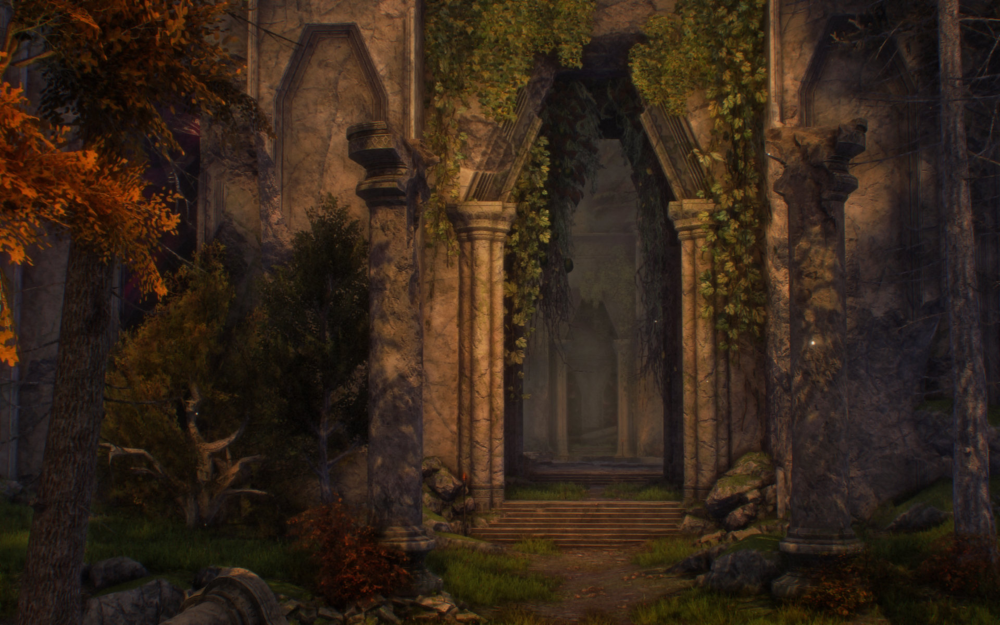 | 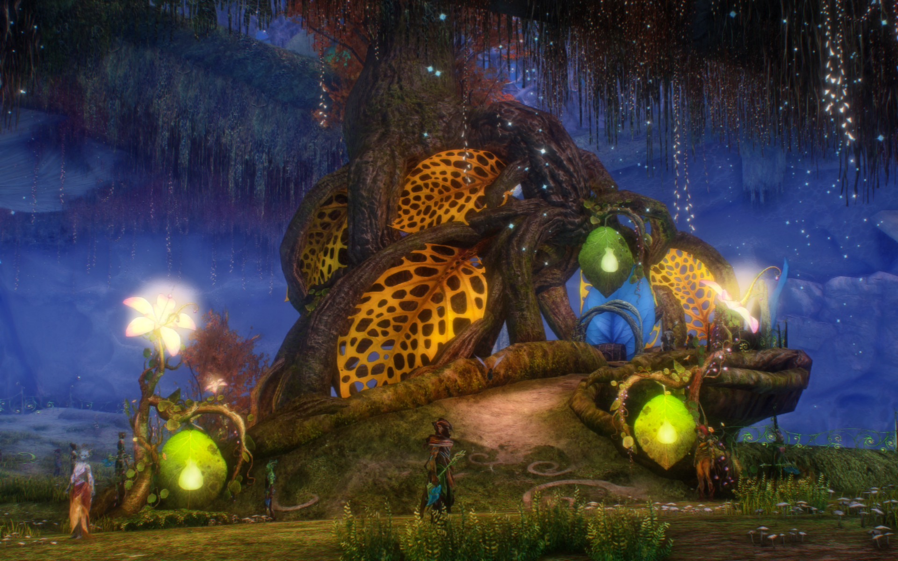 | 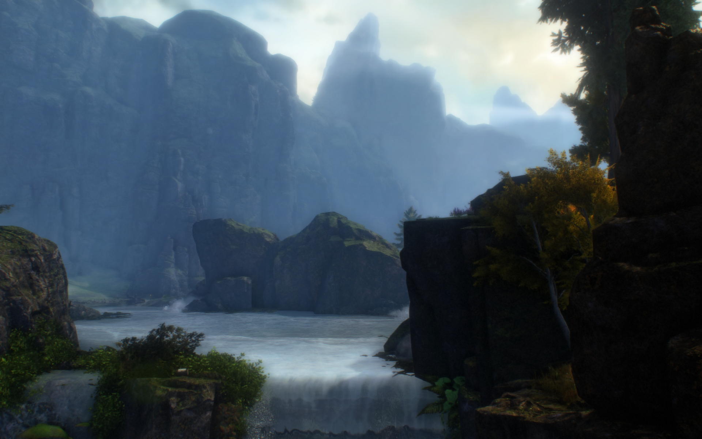 |
| Hoelbrak Sunset | Thrassak Rata Sum | Desert Highlands |
|  |  | 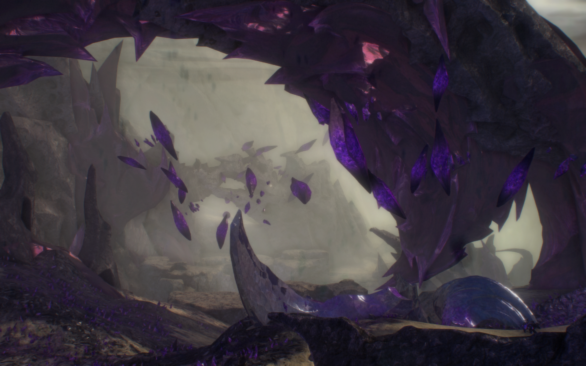 |
| Danala Claypool | Divinity's Reach 2 | Seitung Province |
|  |  | 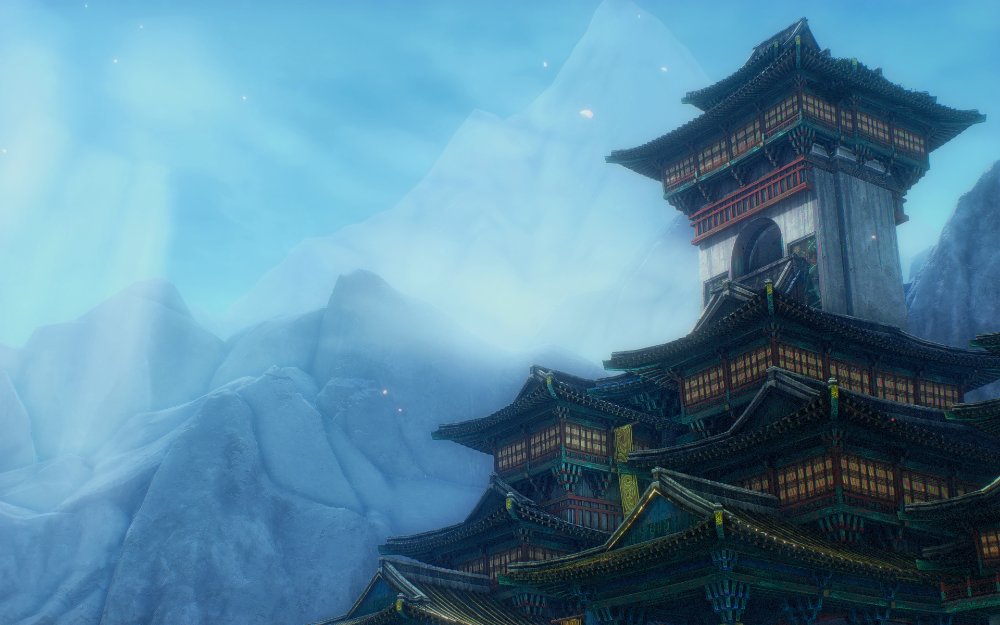 |
| Elora The Grove | Grothmar Valley | The Grove 3 |
| 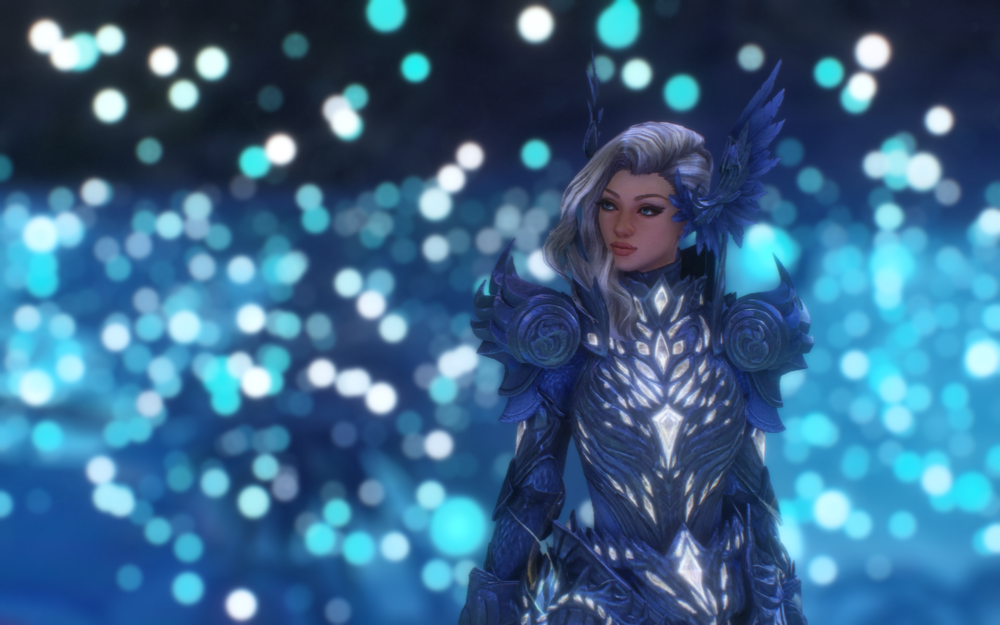 |  |  |
| Bitterfrost Frontier | Hellion Forest | Chaos Crystal Cavern |
|  |  |  |
| Dragonfall | Mistburned Barrens 1 | Crystal Desert |
| 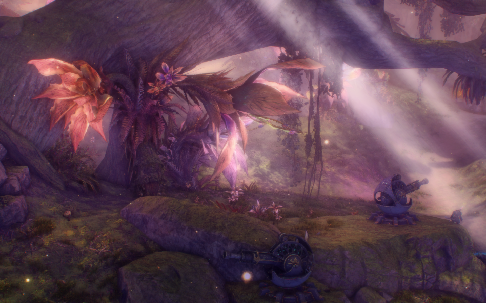 | 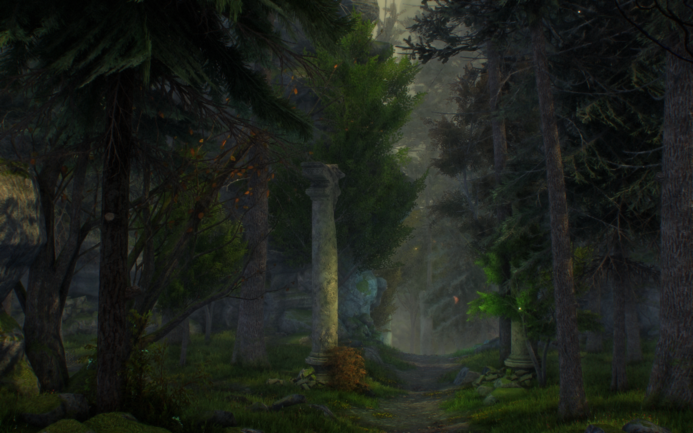 | 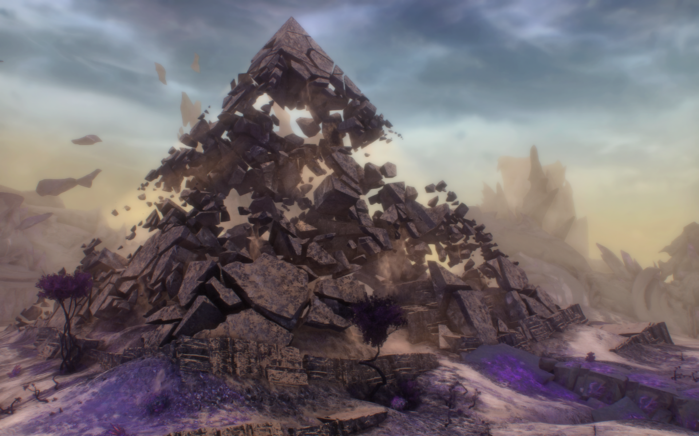 |
| Skywatch Archipelago | Homestead 2 | Homestead 3 |
| 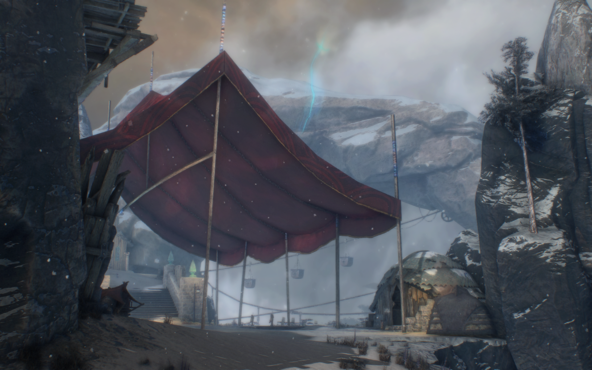 | 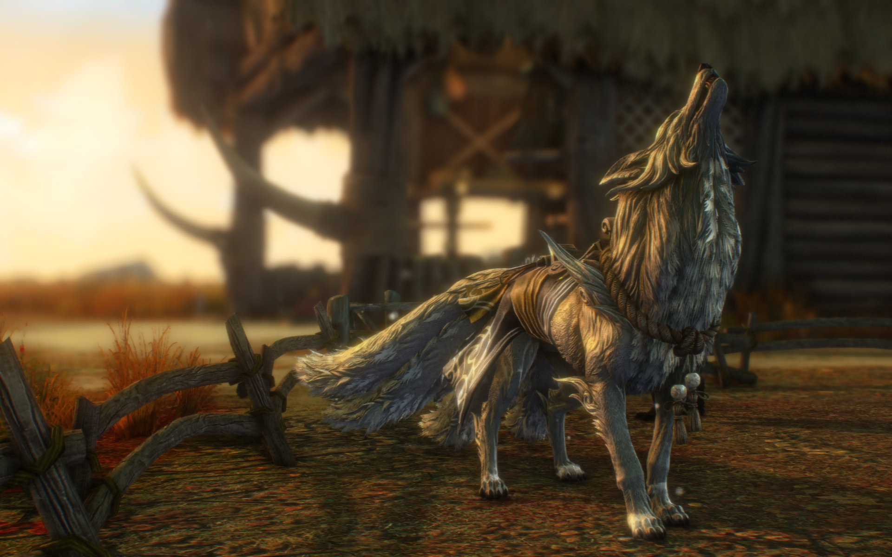 |  |

---

Enjoy your enhanced Guild Wars 2 visuals!
