# Elora's Personal Presets – Guild Wars 2 ReShade (v6.5.1)

Welcome! This guide will walk you through installing and using my custom ReShade preset for Guild Wars 2, updated for ReShade 6.5.1. It includes a full list of required shaders, recommended in-game graphics settings, and tips for best results.

> **Changelog:** See [CHANGELOG.md](./CHANGELOG.md) for recent updates and version history.

---

## Table of Contents

1. [About This Preset](#about-this-preset)
2. [Requirements](#requirements)
3. [Required Shaders (.fx files)](#required-effect-packagesshaders-fx-files)
4. [Installation Instructions](#installation-instructions)
5. [In-Game Graphics Settings (Recommended)](#in-game-graphics-settings-recommended)
6. [FOV & Camera Tips](#fov--camera-tips)
7. [Hardware Recommendations & Performance](#hardware-recommendations--performance)
8. [Troubleshooting & FAQ](#troubleshooting--faq)
9. [License](#license)
10. [Contact](#contact)
11. [Preset Previews](#preset-previews)

---

## About This Preset

**Preset Version:** 2.1.0 (see [CHANGELOG.md](./CHANGELOG.md))

This collection now includes two main preset types:

- **Photo Mode Presets**: Formerly known as "Standard - First Person Photos" and "Standard - Third Person Photos," now renamed to **Photo Mode - First Person** and **Photo Mode - Third Person**. These are designed for high-quality screenshots, with a focus on maximum visual fidelity. The main difference between them is the far blur curve setting in the ADOF.fx filter.

- **Always On Presets**: New in v2.0.0! These are designed for everyday gameplay, targeting high performance (60+ FPS) on modern hardware. The first release includes:
  - **Always On - High - DOF** (Depth of Field enabled)
  - **Always On - High - No DOF** (Depth of Field disabled)

  These presets offer roughly double the FPS of the Photo Mode presets, making them ideal for regular play with high visual quality. Additional presets are currently in development for medium spec systems and low spec systems, check back soon for the new presets!

---

## Requirements

- **Guild Wars 2** (latest version)
- **ReShade 6.5.1** ([Download here](https://reshade.me/#download))
- Windows 10/11

---

## Required Effect Packages/Shaders (.fx files)

Below is the exact list of .fx files required by this preset, as referenced in the preset's Techniques. These effect packages can be installed during the standard setup/installation wizard for ReShade. Ensure these files are present in your ReShade `Shaders` folder:

- Zenteon_Framework.fx ([Zenteon Shaders](https://github.com/Zenteon/Reshade-Shaders))
- MartysMods_LAUNCHPAD.fx ([qUINT by Marty McFly](https://github.com/martymcmodding/qUINT))
- MartysMods_MXAO.fx ([qUINT by Marty McFly](https://github.com/martymcmodding/qUINT))
- PPFX_SSDO.fx ([ReShade Repository](https://github.com/crosire/reshade-shaders))
- NeoSSAO.fx ([ReShade Repository](https://github.com/crosire/reshade-shaders))
- NGLighting.fx ([ReShade Repository](https://github.com/crosire/reshade-shaders))
- AmbientLight.fx ([ReShade Repository](https://github.com/crosire/reshade-shaders))
- ZN_LC.fx ([Zenteon Shaders](https://github.com/Zenteon/Reshade-Shaders))
- CAS.fx ([ReShade Repository](https://github.com/crosire/reshade-shaders))
- HexLensFlare.fx ([ReShade Repository](https://github.com/crosire/reshade-shaders))
- MagicBloom.fx ([ReShade Repository](https://github.com/crosire/reshade-shaders))
- PD80_02_Bloom.fx ([prod80 Shaders](https://github.com/prod80/prod80-ReShade-Repository))
- PD80_04_Color_Temperature.fx ([prod80 Shaders](https://github.com/prod80/prod80-ReShade-Repository))
- Quark_Local_Contrast.fx ([ReShade Repository](https://github.com/crosire/reshade-shaders))
- Quark_Xenon_Bloom.fx ([ReShade Repository](https://github.com/crosire/reshade-shaders))
- Reinhard.fx ([ReShade Repository](https://github.com/crosire/reshade-shaders))
- Vibrance.fx ([ReShade Repository](https://github.com/crosire/reshade-shaders))
- lilium__rcas_hdr.fx ([ReShade Repository](https://github.com/crosire/reshade-shaders))
- Zenteon_Sharpen.fx ([Zenteon Shaders](https://github.com/Zenteon/Reshade-Shaders))
- Zenteon_XenonBloom.fx ([Zenteon Shaders](https://github.com/Zenteon/Reshade-Shaders))
- BloomingHDR.fx ([ReShade Repository](https://github.com/crosire/reshade-shaders))
- GloomAO.fx ([ReShade Repository](https://github.com/crosire/reshade-shaders))
- FGFXLargeScalePerceptualObscuranceIrradiance.fx ([ReShade Repository](https://github.com/crosire/reshade-shaders))
- LocalContrast.fx ([ReShade Repository](https://github.com/crosire/reshade-shaders))
- qUINT_dof.fx ([qUINT by Marty McFly](https://github.com/martymcmodding/qUINT))
- pCamera.fx ([ReShade Repository](https://github.com/crosire/reshade-shaders))
- pColors.fx ([ReShade Repository](https://github.com/crosire/reshade-shaders))
- SmartDeNoise.fx ([ReShade Repository](https://github.com/crosire/reshade-shaders))

> **Note:**
> - The list above is derived directly from the preset's Techniques line. Some techniques may reference the same .fx file with different technique names.
> - If you are missing any of these, you can download them from the official ReShade repositories or the shader authors' GitHubs. Some may be in optional or third-party packs.
> - When installing ReShade, you can select these filters during the setup process, personally, I install all available filters to give myself room to experiment.
> - Additional information on each effect package along with tips for tweaking them yourself (should you choose to do so) can be found in [EFFECTS.md](./EFFECTS.md).

---

## Installation Instructions

1. **Download & Install ReShade 6.5.1**
   - Run the ReShade installer (I recommend the ReShade 6.5.1 with full add-on support for future proofing). ([Download here](https://reshade.me/#download))
   - Select your `Gw2-64.exe` (Guild Wars 2 executable), it may not appear on the default list of applications, and if so, navigate to the default file location and select it `C:\Program Files\Guild Wars 2` (default path).
   - Choose DirectX 10/11/12.
   - If you plan on using my preset and want to streamline the installation, on the next screen you can click the `Browse...` button, navigate to my preset, select it, and it will install all the effect packages used in my preset, otherwise you can click on the `Skip` button.
   - When prompted, select the effect packages you would like to install, if you would like to experiment I suggest clicking the `Check all` button to install all of them, otherwise you can select the files listed above in [Required Shaders (.fx files)](#required-shaders-fx-files). A simpler method however would be to select my .ini file in the previous step.
   - You can safely `Skip` the list of plugins as my presets don't require any at the moment.
   - Click `Finish`.

2. **Copy the Preset**
   - Place `Elora's Personal Presets - Photo Mode - First Person.ini` and `Elora's Personal Presets - Photo Mode - Third Person.ini` into your Guild Wars 2 game folder (`C:\Program Files\Guild Wars 2` by default). For gameplay, use `Elora's Personal Presets - Always On - High - DOF.ini` or `Elora's Personal Presets - Always On - High - No DOF.ini` as appropriate. (Not required if you selected my .ini files in the first step)

3. **Add Required Shaders**
   - Ensure all required .fx files (see above) are in your `reshade-shaders\Shaders` folder. (not required if you installed them in the first step)
   - Place any required textures in `reshade-shaders\Textures` if needed. (not required if you installed them in the first step)

4. **Rename dxgi.dll to d3d11.dll**
   - In `C:\Program Files\Guild Wars 2` (default path) rename the `dxgi.dll` to `d3d11.dll`, this change is required since the update to DX11 in order for ReShade to recognize Guild Wars 2 and initialize during launch. If you'd like to be extra safe, you can create a backup copy of this file first before renaming.

5. **Launch Guild Wars 2**
   - Press `Home` to open the ReShade menu.
   - Select the preset from the dropdown.

6. **Set a Toggle Key** (optional)
   - Navigate to the `Settings` tab.
   - Bind a key for `Effect Toggle Key`.
   - Use your keybind to turn the effect on and off whenever it suits you.

7. **Tweak Settings** (optional)
   - If you like how I have things set up then you can skip this, but if you'd like to simply use my preset as a foundation for more changes you're more than welcome to do that. At the end of the day, this is your game, you should enjoy the way that it looks, and it should suit your preferences. Modify sliders and toggle effects until everything is just right for you. If you need to revert back, you can always just download this preset again or you can create a new preset based on mine using the `Add A New Preset` (Plus Icon) button in the `Reshade Menu` and put a checkmark in the `Inherit Current Preset` checkbox - this way the original preset remains untouched and you get a brand new copy to modify to your heart's content!

---

## In-Game Graphics Settings (Recommended)

For best results, match these settings as closely as possible:

**Display**
- Resolution: Windowed Fullscreen
- Frame Limiter: Unlimited
- Interface Size: Normal
- DPI Scaling: Off
- Full-Screen Gamma: 1.00

**Advanced Settings**
- Animation: High
- Antialiasing: SMAA High
- Environment: High
- LOD Distance: Ultra
- Reflections: All
- Textures: High
- Render Sampling: Supersample
- Shadows: Ultra
- Shaders: High
- Character Model Limit: Highest
- Character Model Quality: Highest
- Best Texture Filtering: On
- Effect LOD: Off
- High-Res Character Textures: On
- Vertical Sync: Off

**Postprocessing**
- Postprocessing Preset: None
- Bloom: Off
- Color Grading: Off
- Color Tint: Off
- Distortion: Off
- Light Rays: Off
- Selection Outline: Off
- Ambient Occlusion: On
- Depth Blur: Off
- Light Adaptation: On
- Motion Blur Power: Medium
- Environment Zone Intensity: Maximum

> **Note:** These settings are crucial for the preset to look as intended. Deviations may result in visual artifacts or reduced quality.

---

## FOV & Camera Tips

- **Field of View (FOV):** When taking screenshots of people I personally switch my FOV all the way to the left (zoomed in), and when taking screenshots of landscapes I'll adjust the FOV slider until it suits my desired composition. Feel free to play around with this and find what works best for you.
- **Camera Position:** Experiment with camera angles and zoom for the best composition.
- **First-Person Camera:** Enable First-Person Camera in `Options` > `General Options` > `Camera` > `Enable First Person Camera` to allow yourself to zoom in and view the game in first person. For screenshots of subjects/people other than your own character, I recommend using first person camera for the most cinematic effect and greatest level of control.
- **Adjust First Person Camera Height:** You can toggle the camera position in First-Person mode to make it align with your character's head in `Options` > `General Options` > `Camera` > `Adjust Camera to Character Height`. 
- **Set a Toggle For Show/Hide UI:** If you plan on taking a lot of screenshots, I would recommend setting a keybind that is easy to use or remember in `Options` > `Control Options` > `User Interface` > `Show/Hide UI` so that way you can quickly toggle the UI on or off
- **Adjust Camera Sliders:** Depending on the kind of screenshots or videos you plan on taking, you may want to adjust additional options in `Options` > `General Options` > `Camera` such as: `Rotation Speed` (for smoother panning), `Horizontal Position` (for compositions that aim for the Rule of Thirds or the Fibonacci Ratio), `Vertical Position Near` and `Vertical Position Far` (again, for compositions that aim for the Rule of Thirds or the Fibonacci Ratio), `Zoom Sensitivity` (to adjust the increments your camera zooms in, for smoother zooming during videos or greater control of zoom in general for photos)
- **Adjust Height With Tonics:** A quick way to adjust your height to get a different perspective is to use `Endless Miniature Tonic` or `Endless Embiggening Tonic`, experiment with them to try to get that perfect shot!

---

## Hardware Recommendations & Performance

**Photo Mode Presets are optimized for:**
- CPU: Intel Core i7-13700HX or AMD Ryzen 7 7735HS
- GPU: NVIDIA GeForce RTX 4050 (6GB VRAM) or AMD Radeon RX 7600M
- RAM: 16 GB DDR5
- Storage: SSD
- OS: Windows 10/11 64-bit
- Performance Target: 1080p @ 40+ FPS with all effects enabled

> **Note:**
> - Photo Mode presets are not intended for regular gameplay, they're meant for taking high quality photos. Please use one of the Always On presets if you intend to use any during gameplay.

**Always On - High Presets are optimized for:**
- CPU: Intel Core i7-13700HX or AMD Ryzen 7 7735HS
- GPU: NVIDIA GeForce RTX 4050 (6GB VRAM) or AMD Radeon RX 7600M
- RAM: 16 GB DDR5
- Storage: SSD
- OS: Windows 10/11 64-bit
- Performance Target: 1080p @ 60+ FPS with all effects enabled

**Always On - High Presets User Testing:**
- On a system with Intel i7-8700K, 32GB RAM, and RTX 2080 Ti:
  - Without DOF: 90–75 FPS
  - With DOF: 80–60 FPS

> **Note:**
> - Always On - High presets deliver roughly double the FPS of the Photo Mode presets.

---

## Troubleshooting & FAQ

**Q: The preset looks wrong, or some effects are missing!**
- Double-check that all required .fx files are present (see above for links).
- Make sure your in-game graphics settings match the recommendations.
- Try reloading the preset in the ReShade menu.
- If depth-based effects (like MXAO or DOF) don't work, try switching between windowed and fullscreen, or check the "Copy depth buffer before clear operations" option in ReShade's settings.
- If you see a black screen or crash, ensure your GPU drivers are up to date and that you are using ReShade 6.5.1.

**Q: My game is running slowly!**
- Some effects (like MXAO, SSDO, and high-quality DOF) are demanding. Disable or lower their quality in the ReShade menu if needed.
- For gameplay, toggle off the most demanding effects or use a lower version of the Always On (High, Medium, or Low) presets, until you achieve a framerame that works best for your system.
- Lower your in-game resolution or reduce supersampling for better performance.

**Q: Where do I get missing shaders?**
- Most are included with the standard ReShade install. For third-party shaders, use the links above or check the [ReShade forums](https://reshade.me/forum/) or the shader author's GitHub.

**Q: Guild Wars 2 won't launch with ReShade, or ReShade doesn't appear?**
- Make sure you renamed `dxgi.dll` to `d3d11.dll` in your GW2 folder (see Installation Instructions).
- Some overlays (Discord, Steam, etc.) can interfere—try disabling them.

---

## License

This project is licensed under the MIT License. See [LICENSE](./LICENSE) for details. You are free to use, modify, and share these presets, but please credit Elora/AlteredM1nd if redistributing or showcasing them.

---

## Contact

For questions, feedback, or suggestions:
- Discord: alteredm1nd
- Reddit: u/alteredm1nd
- In Game: AlteredMind.3275
- GitHub Issues
- GitHub Discussions

---

## Preset Previews

| The Grove | The Grove 2 | Lowland Shore |
|-----------|-------------|---------------|
|  |  |  |
| Hoelbrak Sunset | Sarah Rata Sum | Elora Rata Sum |
|  | 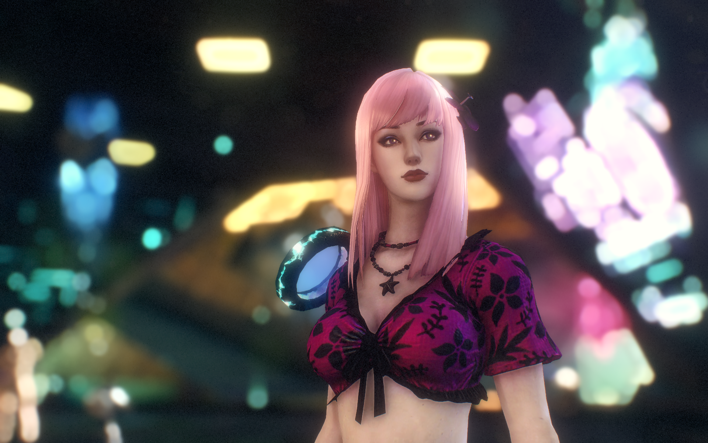 |  |
| Divinity's Reach | Elora Rata Sum 3 | Alina Rata Sum |
|  | 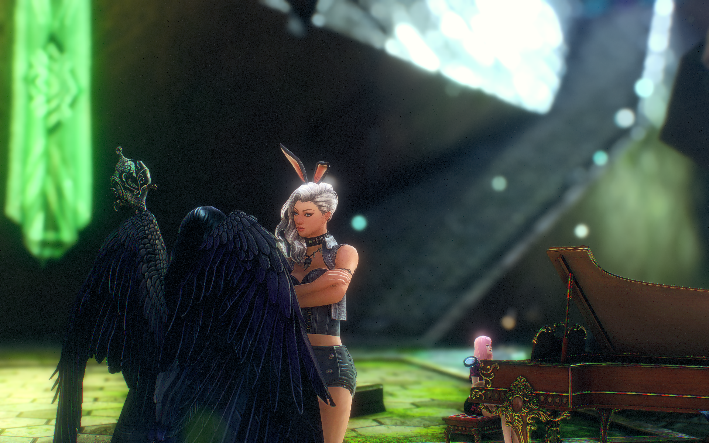 | 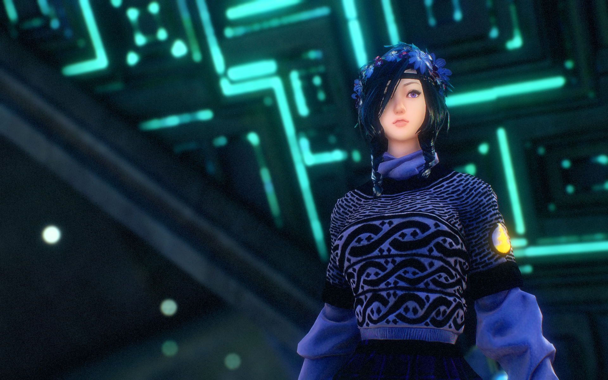 |
| Erelith Rata Sum | Eirene Rata Sum | Thrassak Rata Sum |
| 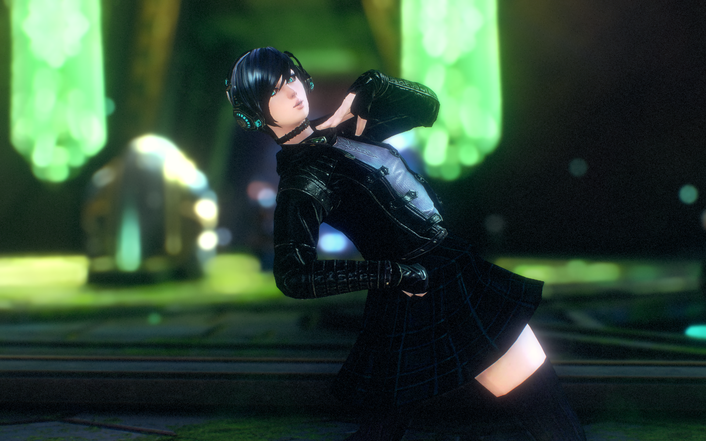 | 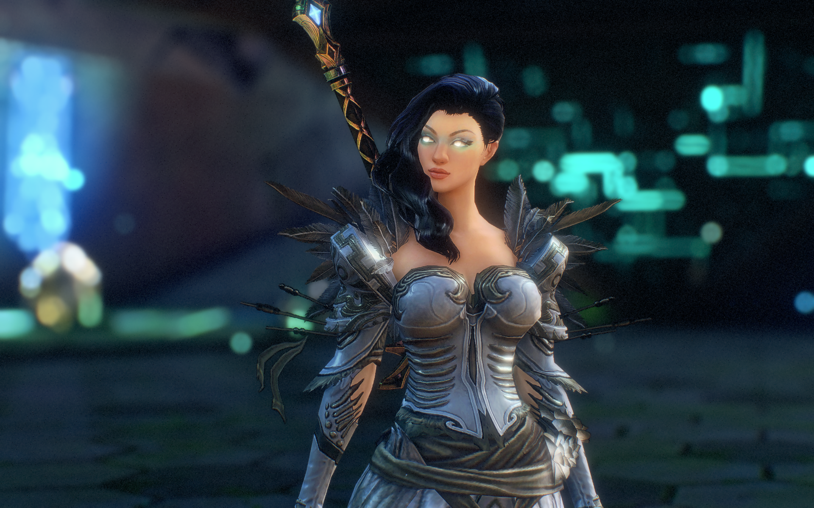 | 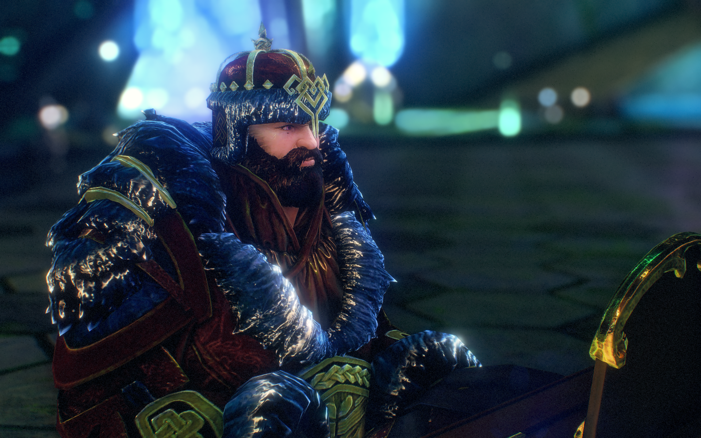 |
| Danala Claypool | Divinity's Reach 2 | Cantha |
| 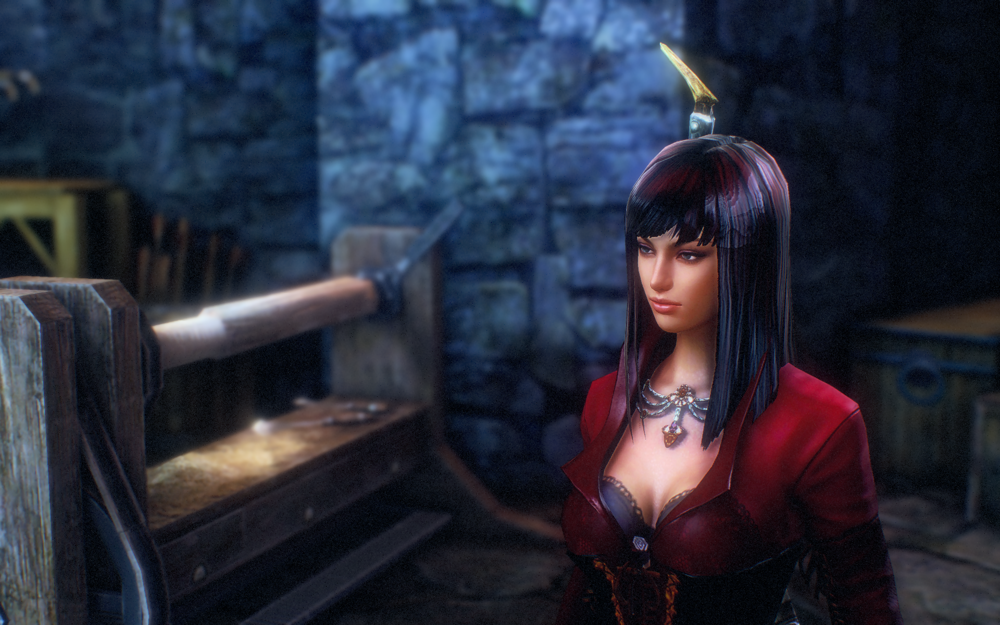 |  | 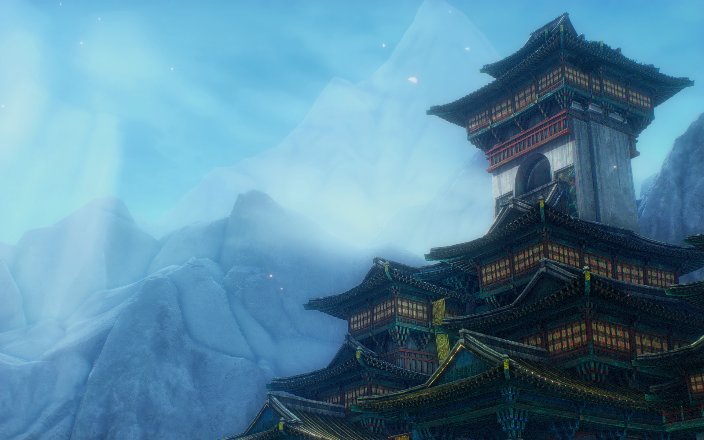 |
| Elora The Grove | Grothmar Valley | The Grove 3 |
| 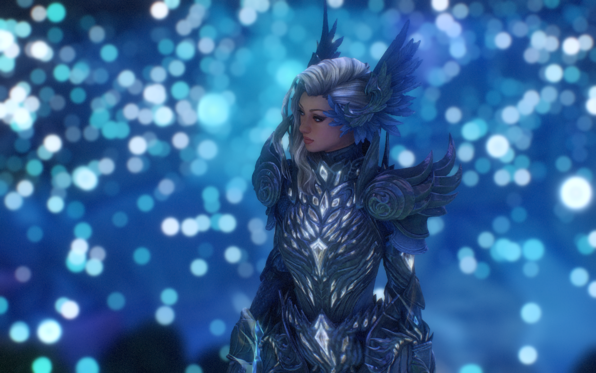 | 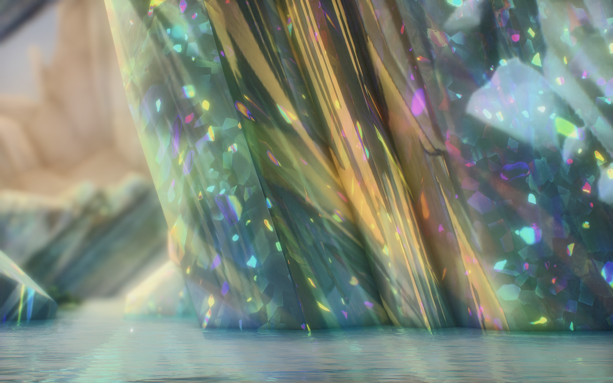 | 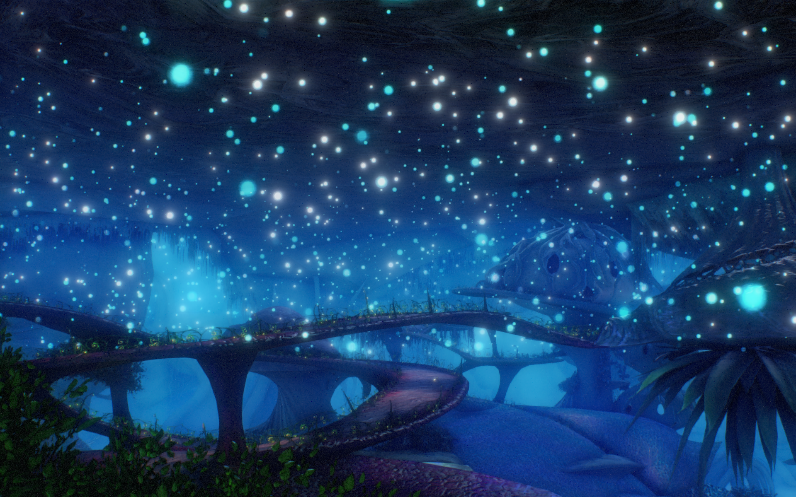 |
| Bitterfrost Frontier | Divinity's Reach 3 | Chaos Crystal Cavern |
| 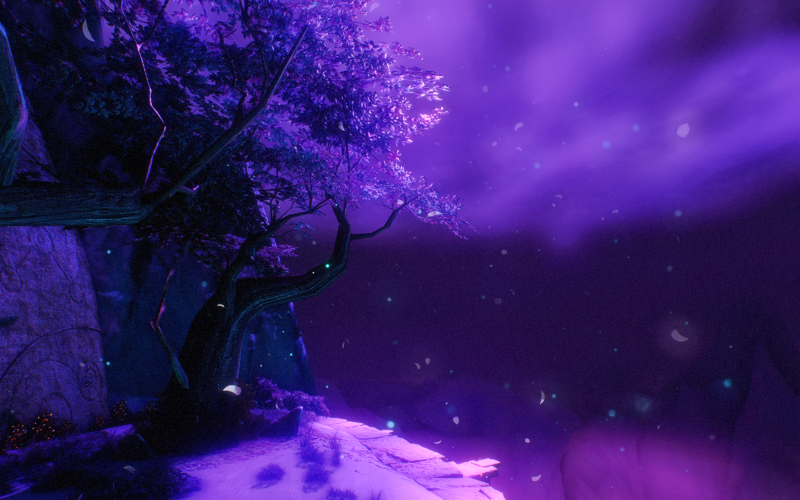 |  |  |

---

Enjoy your enhanced Guild Wars 2 visuals!
